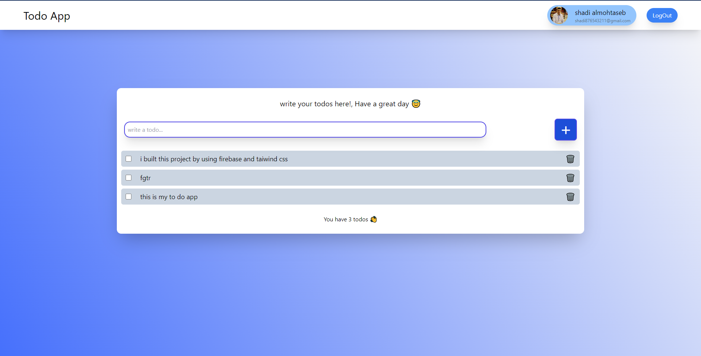
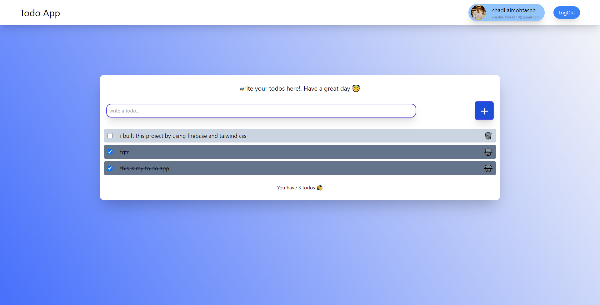
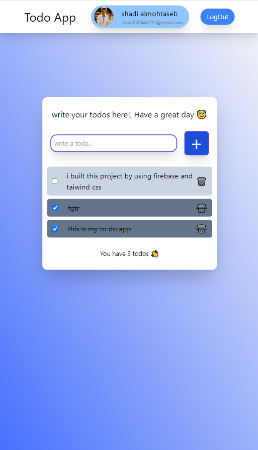

# Firebase Todo App 

in this project, I used Firebase authentication for registering users and Firebase storage to store the todos, and I managed the whole app using useContext hook (context API) to manage my states.

## Learning Objectives

 - Firebase Auth
 - Context API
 - CRUD operation 

## App Preview

